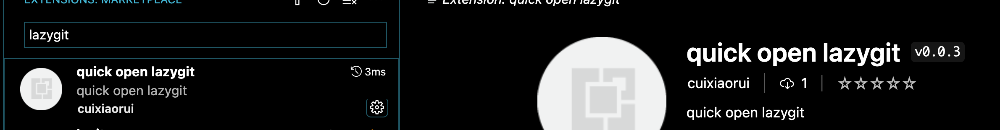
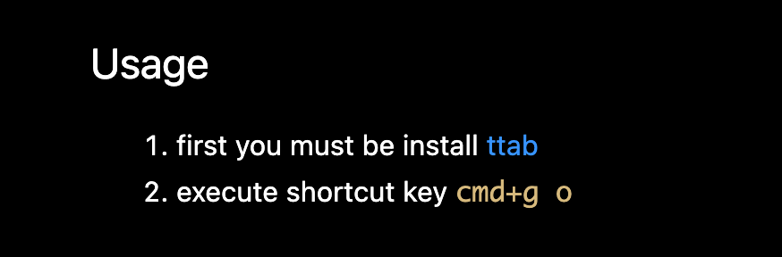
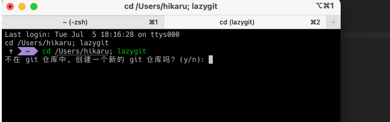
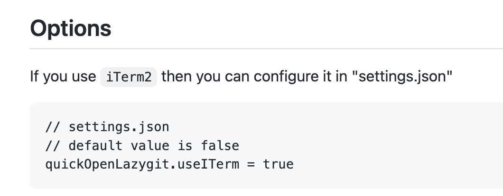
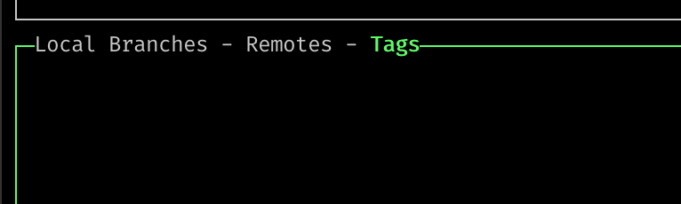

## 任务点

```zsh
brew install lazygit
```

配置别名：

```zsh
echo "alias lg=lazygit">>~/.zshrc
```

通过 hl 来切换面板，比如当前切换到 commits 里，可以通过 jk 来在内部进行切换

可以通过 `x` 打开菜单

当选中 files 面板后，可以通过 `Space` 来进行 add 操作，将文件放到 staged changes，也可以通过 `Space` 来进行 remove 操作，将文件从 staged changes 删除

可以通过 `c` 来进行提交操作，如果想要 reset，只需要选中某次提交的 commit，然后按 `g` 即可

键入 `p` 进行 push 操作。

当然还可以进行更复杂的操作：

可以在第二个面板，按下 `Enter` 进入右侧区域，通过 `tab` 来回切换 `staged` 区域和 `unstaged` 区域，通过 `Space` 来以行为单位进行 add 操作或者 remove 操作

如果要把工作区的文件全部放到暂存区，可以在工作区键入 `a`，就可以全部放到 staged 暂存区，再次键入 `a` 就可以移出暂存区

如果要取消某文件的修改，可以键入 `d`（discard changes）；键入 `D` 是针对于所有的修改过的文件来做 discard

## 社群讨论

lazygit 设置别名后不生效的记得打这个命令 source ~/.zshrc

<hr />

html tag 跳到闭合 tag 可以吗？vscode vim 有没有对应快捷键 还是说之前说过我忘了

你用 f 跳呗

<hr />

lazygit 我装完竟然是中文的

我也是中文的

系统语言是中文，所以是中文？

<hr />

lazygit 真的好爽。。。可惜 windows 不行

你可以用 Sourcetree

source tree 也支持 vim 命令？我记得就是一个可视化的 git 工具吧

对，还以为你就想要一个可视化工具哈哈

哈哈，我还以为这家伙现在变高级了呢

好吧我错了，lazygit 在 windows 上同样适用

<hr />

我去试试如何在 vscode 中直接召唤出来 lazygit

嗯嗯，配上一个快捷键应该可以滴

目前唯一的解决方案就是在 vscode 内置的 terminal 打开了

得写个插件才能解决这个问题

给 iterm2 设置个一键唤起不行吗

主要是两个点：一个是路径问题，一个是传参问题。Vscode 支持打开 iterm   但是不支持传参





来   试试，vscode 快速打开 lazygit，先安装 ttab



他默认打开这个。

有用 iTerm2 嘛？加个配置



这个是 vscode 的 settings.json 么

是滴

可以了。

我感觉 command+j lg 打开也够用。

喜欢用 vscode 的原因就是   啥功能没有 自己写个插件就好了，这也是为啥使用 obsidian 的原因

我一直不知道 typora 和 obsidian 啥区别。。。。对于这些工具感觉能用好像就行。。。

<hr />

不知道为什么 arm 架构的安装是错误的，网上查了但是提供的方法不管用。就是安装 lazygit 的时候

我也是 arm，木有问题

<hr />

怎么切换 branches remotes tags 鸭



[ 向左切换 ] 向右切换
